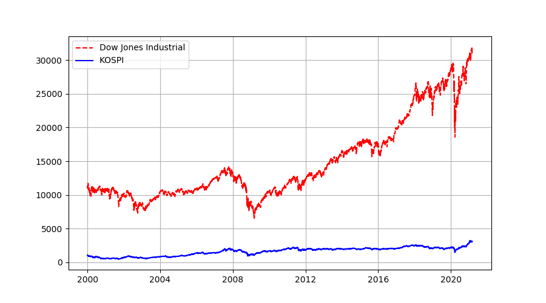
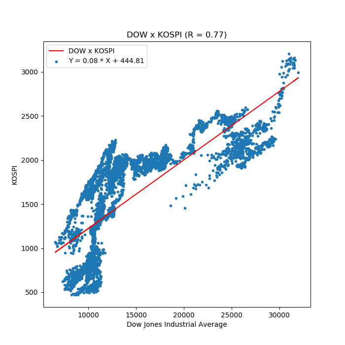
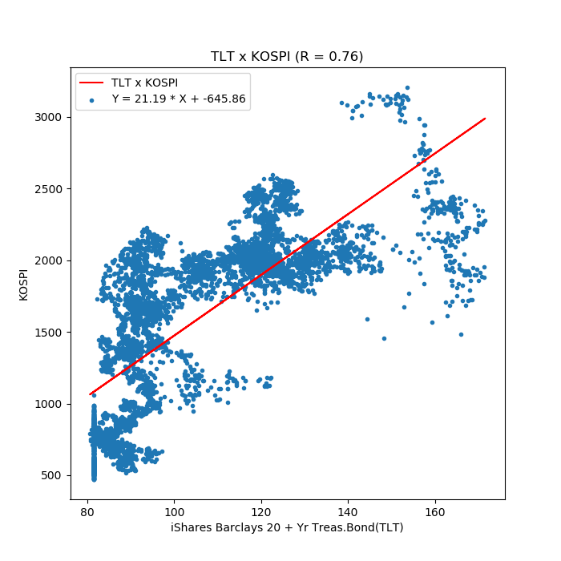

# 3. Pandas를 활용한 데이터 분석

작성일시: Feb 28, 2021 5:00 PM

# 3.1 넘파이 배열

Numpy는 Numerical Python의 줄임말로, 수치 해석, 통계 작업을 구현할 때 기본이 되는 모듈이다. 넘파이의 상당 부분이 C언어와 포트란으로 작성되어 속도가 파이썬 기본 자료 구조 사용시보다 빠르며, 다차원 배열 연산 기능은 인공지능 관련 개발에 꼭 필요한 요소이다.

### 배열 생성 및 접근

```python
import numpy as np
#배열 생성
A = np.array([[1, 2], [3, 4]])
print(A)

print(A.ndim) # 배열의 차원 반환
>>2
print(A.shape) # 튜플 형태로 반환
>>(2, 2)
print(A.dtype) # 원소 자료형
>>int32

# 원소별 최댓값, 최솟값, 평균값, 합계 구하기
print(A.max(), A.mean(), A.min(), A.sum())
>> 4 2.5 1 10

# 배열에 접근하는 방법(리스트와 유사하지만 다른 부분이 있음)
print(A[0][0], A[0][1]); print(A[1][0], A[1][1])
이렇게 리스트에서 접근하는 방법처럼 접근해도 되지만,
print(A[0, 0], A[0, 1]); print(A[1, 0], A[1, 1])
이렇게 실제로 우리가 생각하는 방식대로 입력해도 알아듣는다.

결과는 둘 다 아래와 같다.
1 2
3 4
```

### 배열 형태 바꾸기

```python
# 전치행렬
print(A.transpose())
이 경우 A의 전치행렬이 반환된다. 원본을 바꾸지는 않는다.

# 평탄화
print(A.flatten())
>> [1 2 3 4]
다차원 배열을 1차원 배열 형태로 바꾼다.
```

### 배열의 연산

```python
# 같은 크기의 행렬끼리는 사칙 연산이 가능!
>>>A
array([[1, 2],
		[3, 4]])
A가 위와 같을 때,
>>>A+A
array([[2, 4],
			[6, 8]])

>>>A-A
array([[0, 0],
			[0, 0]])

>>>A*A
array([[1, 4],
			[9, 16]])

>>>A/A
array([[1., 1.],
			[1., 1.]])
```

### 브로드캐스팅(크기가 다른 행렬끼리의 연산)

```python
A = [[1, 2], [3, 4]]
B = [10, 100]

A * B = [[10, 200], [30, 400]]
이와 같이 계산되는 것을 말한다.
B의 경우 자동으로 2*2배열이 되어 부족한 부분을 채우게 되는 것!

-->B = [[10, 100], [10, 100]]
```

### 내적 구하기

```python
m x k 행렬과 k x n 행렬을 내적하면 m x n 행렬이 된다.
넘파이에서 기본적으로 행렬간 곱셈을 하면 각 원소끼리 곱셈이 되므로, 
내적을 구하기 위해서는 dot() 함수를 사용해야 한다.

np.dot(A, B) # 앞이 행, 뒤가 열
A.dot(B) #마찬가지로 앞이 행, 뒤가 열
```

# 3.2 pandas

판다스는 금융 데이터 분석이 목적!

panel data + python data analysis → pandas

panel data: 동일한 조사 대상으로부터 여러 시점에 걸쳐 반복적으로 수집한 데이터

넘파이를 기반으로 구현하여 대부분 함수가 넘파이와 유사하며, 파이플롯과 호환이 쉬워 데이터 과학용 기본 라이브러리로 활용된다.

### 시리즈 생성

시리즈는 시간의 흐름에 따라 기록한 데이터인 시계열 데이터를 다루는 데 적합한 자료 형태이다.

리스트나 튜플 등의 시퀀스를 인수로 받아 시리즈를 생성할 수 있다.

```python
import pandas as pd
s = pd.Series([0.0, 3.6, 2.0, 5.8, 4.2, 8.0])
>>>s
0    0.0
1    3.6
2    2.0
3    5.8
4    4.2
5    8.0
dtype: float64
```

### 시리즈의 인덱스 변경

```python
>>>s.index = pd.index([0.0, 1.2, 1.8, 3.0, 3.6, 4.8])
>>>s.index.name = 'MY_IDX'
>>>s
MY_IDX
0.0    0.0
1.2    3.6
1.8    2.0
3.0    5.8
3.6    4.2
4.8    8.0
dtype: float64
```

인덱스를 별도로 지정하지 않으면 0부터 시작하는 정수형 인덱스가 자동 생성되고, 사용자가 임의로 이를 지정해 줄 수 있음! 인덱스 이름을 지정해주면 인덱스 열 위에 인덱스명이 표시된다.

시리즈명을 지정해 어떤 데이터인지 예상할 수 있도록 만들 수 있다.

```python
>>>s.name = 'MY_SERIES'
>>>s
MY_IDX
0.0    0.0
1.2    3.6
1.8    2.0
3.0    5.8
3.6    4.2
4.8    8.0
Name: MY_SERIES, dtype: float64
```

### 데이터 추가

```python
>>>s[5.9] = 5.5
>>>s
MY_IDX
0.0    0.0
1.2    3.6
1.8    2.0
3.0    5.8
3.6    4.2
4.8    8.0
5.9    5.5
Name: MY_SERIES, dtype: float64

또는 새로운 시리즈를 생성한 후 append()로 추가할 수도 있다.
이럴 경우 기존의 시리즈명과 인덱스명은 사라지므로, 필요하다면 다시 설정해야 함!
ser = pd.Series([6.7, 4.2], index=[6.8, 8.0])
s = s.append(ser)
s
0.0    0.0
1.2    3.6
1.8    2.0
3.0    5.8
3.6    4.2
4.8    8.0
5.9    5.5
6.8    6.7
8.0    4.2
```

### 데이터 인덱싱

```python
원하는 순서의 인덱스 값 구하기!
>>>s.index[-1]
8.0

원하는 순서의 밸류 값 구하기!
>>>s.values[-1]
4.2

(딕셔너리처럼) 인덱스를 이용해서 실제로 가리키는 작업을 수행할 수 있다.
>>>s.loc[8.0]
4.2

원하는 순서의 데이터 값 가져오기
>>>s.iloc[-1]
4.2

iloc와 values가 같은 역할을 하는 것 같아서 의아했는데, 
values는 결과값이 복수 개일 때 배열로 반환하고,
iloc는 결과값이 복수 개일 때 시리즈로 반환하는 차이점이 있다고 한다.
```

### 데이터 삭제

삭제하고자 하는 원소의 인덱스값을 넘겨준다.

```python
>>>s.drop(8.0)
s
0.0    0.0
1.2    3.6
1.8    2.0
3.0    5.8
3.6    4.2
4.8    8.0
5.9    5.5
6.8    6.7
dtype: float64
```

### 시리즈 정보 보기

편차, 최솟값, 사분위수, 최댓값을 확인할 수 있음.

```python
>>>s.describe()
count    9.000000
mean     4.444444
std      2.430078
min      0.000000
25%      3.600000
50%      4.200000
75%      5.800000
max      8.000000
dtype: float64
```

### 시리즈 출력하기

```python
import pandas as pd
s = pd.Series([0.0, 3.6, 2.0, 5.8, 4.2, 8.0, 5.5, 6.7, 4.2])
s.index = pd.Index([0.0, 1.2, 1.8, 3.0, 3.6, 4.8, 5.9, 6.8, 8.0])

s.index.name = 'MY_DIX'
s.name = 'MY_SERIES'

import matplotlib.pyplot as plt
plt.title("ELLIOTT_WAVE")
plt.plot(s, 'bs--')
plt.show() #파이참에서는 이게 있어야 Figure 팝업이 띄워짐
plt.xticks(s.index)
plt.yticks(s.values)
```

# 3.3 판다스 데이터프레임

시리즈는 단일 변수 관측값(삼성전자의 일별 주식 가격 등)을 기록하기에 적합하다. 하지만 여러 데이터를 한번에 기록하려면 데이터프레임을 사용하는 것이 효율적이다.

데이터프레임 = 인덱스 하나 + 여러 시리즈를 합친 자료형

엑셀 파일, HTML파일, 데이터베이스로부터 데이터를 읽어와 데이터프레임 형태로 가공할 수 있음. 그 반대도 가능!

### 딕셔너리를 이용한 데이터프레임 생성

2014년부터 2018년까지의 코스피 지수와 코스닥 지수를 이용하여 데이터프레임을 만들어보자.

```python
# 딕셔너리로 데이터프레임 생성
import pandas as pd
df = pd.DataFrame({'KOSPI': [1915, 1961, 2026, 2467, 2041],
                   'KOSDAQ': [542, 682, 631, 798, 675]})
print(df)

			KOSDAQ  KOSPI
0     542   1915
1     682   1961
2     631   2026
3     798   2467
4     675   2041

# 인덱스 추가
import pandas as pd
df = pd.DataFrame({'KOSPI': [1915, 1961, 2026, 2467, 2041],
                   'KOSDAQ': [542, 682, 631, 798, 675]},
                  index = [2014, 2015, 2016, 2017, 2018])
print(df)

				KOSDAQ  KOSPI
2014     542   1915
2015     682   1961
2016     631   2026
2017     798   2467
2018     675   2041

# 시리즈와 마찬가지로, describe() 를 사용할 수 있음.
print(df.describe())

			 KOSDAQ        KOSPI
count    5.000000     5.000000
mean   665.600000  2082.000000
std     92.683871   221.117616
min    542.000000  1915.000000
25%    631.000000  1961.000000
50%    675.000000  2026.000000
75%    682.000000  2041.000000
max    798.000000  2467.000000

# 인덱스 정보, 칼럼 정보, 메모리 사용량 등을 확인하는 데 info() 메서드 사용 가능.
print(df.info())
<class 'pandas.core.frame.DataFrame'>
Int64Index: 5 entries, 2014 to 2018
Data columns (total 2 columns):
KOSDAQ    5 non-null int64 # 첫 번째 칼럼 정보
KOSPI     5 non-null int64 # 두 번째 칼럼 정보
dtypes: int64(2)
memory usage: 120.0 bytes
```

### 시리즈를 이용한 데이터프레임 생성

```python

kospi = pd.Series([1915, 1961, 2026, 2467, 2041],
                  index = [2014, 2015, 2016, 2017, 2018], name='KOSPI')

kosdaq = pd.Series([542, 682, 631, 798, 675],
                   index=[2014, 2015, 2016, 2017, 2018], name='KOSDAQ')

df = pd.DataFrame({kospi.name: kospi, kosdaq.name: kosdaq})
print(df)

			KOSDAQ  KOSPI
2014     542   1915
2015     682   1961
2016     631   2026
2017     798   2467
2018     675   2041
```

시리즈를 하나하나 만들고 딕셔너리 형태로 입력시켜주기..

### 리스트를 이용한 데이터프레임 생성

```python
columns = ['KOSPI', 'KOSDAQ']
index = [2014, 2015, 2016, 2017, 2018]
rows = []
rows.append([1915, 542])
rows.append([1961, 682])
rows.append([2026, 631])
rows.append([2467, 798])
rows.append([2041, 675])
df = pd.DataFrame(rows, columns=columns, index=index)
print(rows)
print(df)

[[1915, 542], [1961, 682], [2026, 631], [2467, 798], [2041, 675]]

      KOSPI  KOSDAQ
2014   1915     542
2015   1961     682
2016   2026     631
2017   2467     798
2018   2041     675
```

### 데이터프레임 순회 처리(데이터프레임 읽는 방법)

```python
for i in df.index:
    print(i, df['KOSPI'][i], df['KOSDAQ'][i])

#행->열 순서가 아니라 데이터 이름->행 번호 순서로 읽어올 수가 있는듯..

# itertuples는 데이터프레임의 각 행을 이름있는 튜플 형태로 반환한다!
for row in df.itertuples(name='KRX'): #KRX라는 이름의 튜플로 반환
    print(row)
KRX(Index=2014, KOSPI=1915, KOSDAQ=542)
KRX(Index=2015, KOSPI=1961, KOSDAQ=682)
KRX(Index=2016, KOSPI=2026, KOSDAQ=631)
KRX(Index=2017, KOSPI=2467, KOSDAQ=798)
KRX(Index=2018, KOSPI=2041, KOSDAQ=675)

for row in df.itertuples(name='KRX'): #KRX라는 이름의 튜플로 반환
    print(row[0], row[1], row[2])
# 일반적으로 이렇게 사용한다고 함. 이렇게 하면 그 값만 보여줌
2014 1915 542
2015 1961 682
2016 2026 631
2017 2467 798
2018 2041 675

# iterrows() 를 사용하면 각 행을 인덱스와 시리즈로 반환한다. 사용법은 itertuples와 비슷하다.

for idx, row in df.iterrows():
    print(idx, row[0], row[1])
2014 1915 542
2015 1961 682
2016 2026 631
2017 2467 798
2018 2041 675
```

# 3.4 주식 비교하기

야후 파이낸스의 API를 통해 삼성전자와 미국 시가총액 1위 주식의 일별 주가 데이터를 야후 파이낸스로부터 다운로드 받아 어떤 종목의 수익률이 더 좋았는지 확인해 보자.

```python
1. 야후 파이낸스 설치!
pip install yfinance #굳이 필요한가?

2. pandas 데이터리더 라이브러리 설치!
pip install pandas-datareader

3. get_data_yahoo() 함수를 사용하여 주식 시세를 구한다.

get_data_yahoo(조회할 주식 종목 [, start=조회 기간의 시작일][, end=조회 기간의 종료일])
```

get_data_yahoo에서 조회 기간을 생략하면 야후가 보유한 데이터에서 가장 오래된 일자부터 최신 일자까지로 설정된다.

코스피 종목은 종목코드 뒤에 .KS를 붙이고, 코스닥은 .KQ를 붙인다. 미국은 'BTWN' 처럼 심볼을 사용하여 조회한다. 여러 종목을 조회하려면 리스트를 인수로 넘겨줄 수 있다. 

삼성전자(005930.KS)와 애플(AAPL)의 주식 데이터를 가져와보자.

```python
from pandas_datareader import data as pdr

sec = pdr.get_data_yahoo('005930.KS', start = '2020-03-01')
aapl = pdr.get_data_yahoo('AAPL', start = '2020-03-01')
print(sec)
print(aapl)

#Volume = 거래량, adj close = 수정 종가(액면 분할 등에 의해 주식 가격에 변동이 있는 경우 가격 변동 이전에 거래된 가격을 현재 주식 가격에 맞춰 수정하여 표시한 가격)
adj close는 신경쓰지 말고, close(종가)를 보는게 맞겠다.

			High      Low     Open    Close      Volume     Adj Close
Date                                                                    
2020-03-02  55500.0  53600.0  54300.0  55000.0  30403412.0  52579.445312
2020-03-03  56900.0  55100.0  56700.0  55400.0  30330295.0  52961.839844
2020-03-04  57600.0  54600.0  54800.0  57400.0  24765728.0  54873.816406
2020-03-05  58000.0  56700.0  57600.0  57800.0  21698990.0  55256.210938
2020-03-06  57200.0  56200.0  56500.0  56500.0  18716656.0  54013.425781
...             ...      ...      ...      ...         ...           ...
2021-02-22  84200.0  82200.0  83800.0  82200.0  25419886.0  82200.000000
2021-02-23  82900.0  81100.0  81200.0  82000.0  20587314.0  82000.000000
2021-02-24  83600.0  81300.0  81800.0  82000.0  26807651.0  82000.000000
2021-02-25  85400.0  83000.0  84000.0  85300.0  34155986.0  85300.000000
2021-02-26  83400.0  82000.0  82800.0  82500.0  38520800.0  82500.000000

[246 rows x 6 columns]
                  High         Low  ...       Volume   Adj Close
Date                                ...                         
2020-03-02   75.360001   69.430000  ...  341397200.0   74.127892
2020-03-03   76.000000   71.449997  ...  319475600.0   71.773636
2020-03-04   75.849998   73.282501  ...  219178400.0   75.102829
2020-03-05   74.887497   72.852501  ...  187572800.0   72.666725
2020-03-06   72.705002   70.307503  ...  226176800.0   71.701706
...                ...         ...  ...          ...         ...
2021-02-22  129.720001  125.599998  ...  103607600.0  126.000000
2021-02-23  126.709999  118.389999  ...  157859100.0  125.860001
2021-02-24  125.559998  122.230003  ...  110691500.0  125.349998
2021-02-25  126.459999  120.540001  ...  147306500.0  120.989998
2021-02-26  124.849998  121.199997  ...  164320000.0  121.260002

[251 rows x 6 columns]
```

**지금 위의 데이터는 날짜별 인덱스에 각 시리즈가 칼럼으로 들어가 있는 형태이다.**

여기서 전체 데이터가 아닌 일부를 살피고 싶다면(시험삼아), .head()를 사용할 수 있다. head 안에 입력한 숫자만큼의 행을 표현한다.

ex) sec.head(10) #10개 행(10일치) 표시

tail()은 마지막 다섯 개 행을 표시한다.

ex) sec.tail() #마지막 5일치 정보 표시

불필요한 데이터를 제거할 수도 있다. 예를 들어 거래량이 필요 없다면

```python

tmp_msft = msft.drop(columns='Volume')

```

위 코드를 사용하면 Volume 이 제거된 tmp_msft라는 주가 정보가 만들어진다.

**중요 포인트**

주가 정보에서 원하는 부분을 조작하려면 인덱스나 칼럼 이름을 알고 있어야 한다. 그걸 확인하는 방법은??

```python
print(sec.index)
print(sec.columns)

DatetimeIndex(['2020-03-02', '2020-03-03', '2020-03-04', '2020-03-05',
               '2020-03-06', '2020-03-09', '2020-03-10', '2020-03-11',
               '2020-03-12', '2020-03-13',
               ...
               '2021-02-15', '2021-02-16', '2021-02-17', '2021-02-18',
               '2021-02-19', '2021-02-22', '2021-02-23', '2021-02-24',
               '2021-02-25', '2021-02-26'],
              dtype='datetime64[ns]', name='Date', length=246, freq=None)
#컬럼 정보
Index(['High', 'Low', 'Open', 'Close', 'Volume', 'Adj Close'], dtype='object')
```

**삼성전자와 애플의 종가 비교 그래프로 나타내기!**

```python
from pandas_datareader import data as pdr
import matplotlib.pyplot as plt
sec = pdr.get_data_yahoo('005930.KS', start = '2020-03-01')
aapl = pdr.get_data_yahoo('AAPL', start = '2020-03-01')

plt.plot(sec.index, sec.Close, 'b', label='Samsung Electronics') # 푸른 색 실선
plt.plot(aapl.index, aapl.Close, 'r--', label='Apple') # 빨간색 -- 선
plt.legend(loc='best') # location = best, 그림이 겹치지 않는 가장 좋은 위치에 범례를 표시해준다.
plt.show()
```


달러와 원화의 차이에 의해 애플의 주식은 직선처럼 보인다. 가격이 다른 두 주가의 수익률을 비교하려면 일간 변동률(daily percent change)을 구해야 한다.

오늘 변동율 = [(오늘 종가 - 어제 종가) / 어제 종가] X 100

```python
sec_dpc = (sec['Close'] / sec['Close'].shift(1) - 1) * 100
print(sec_dpc.head())

2020-03-02         NaN
2020-03-03    0.727273
2020-03-04    3.610108
2020-03-05    0.696864
2020-03-06   -2.249135
Name: Close, dtype: float64
```

종가의 변동율을 첫날부터 5일까지 표현한 것이다. 첫 날은 이전 데이터가 없으므로 NaN이 되었다. 여기서 사용한 shift(n)는 전체 데이터가 n행씩 뒤로 이동하게 만드는 함수로, 여기서는 1을 넣어 3월 2일의 데이터가 3월 3일로 이동하게 만들었다. 따라서, 이동한 데이터는 어제의 종가가 되고, 계산할 때 기존의 데이터 - shift한 데이터가 결국 오늘 종가 - 어제 종가가 된다.

```python
#계산을 위해 NaN을 0으로 바꿔주기
sec_dpc.iloc[0] = 0
```

**일간 주가 변동률 히스토그램**

```python
from pandas_datareader import data as pdr
import matplotlib.pyplot as plt
sec = pdr.get_data_yahoo('005930.KS', start = '2020-03-01')
aapl = pdr.get_data_yahoo('AAPL', start = '2020-03-01')
sec_dpc = (sec['Close']-sec['Close'].shift(1)) / sec['Close'].shift(1) * 100
sec_dpc.iloc[0] = 0
plt.hist(sec_dpc, bins=18) #18개 구간으로 나누기
plt.grid(True)
plt.show()
```


신기하게도 책의 기간과 지금 내가 잡은 기간이 다른데도 삼성전자의 일별 주가 변동률의 히스토그램 형태는 비슷했다. 정규 분포와 비슷한 형태였는데, 몇 달 전 삼성전자가 급등했을 때의 변동률이 나홀로 맨 오른쪽에 표시되어 있는 점이 특이하다.

일반적으로 주가의 히스토그램은 급첨 분포와 팻 테일 형태로 나눌 수 있다고 한다. 이게 무슨 뜻인가 싶었지만, 설명을 보고 나니 명확히 이해 됐다.

급첨 분포(leptokurtic distribution): 가운데 부분이 뾰족한 히스토그램을 말한다. 가로축이 주가의 일일 변동률이므로 가운데가 뾰족하다는 것은 주가 변동이 크지 않은 날이 더 많다는 뜻이다.

팻 테일(fat tail): 꼬리 부분이 두껍다는 뜻으로, 주가 변동이 큰 주식이 이러한 형태를 나타낼 것이다.

급첨 분포가 흔히 말하는 우량주, 팻 테일이 흔히 말하는 잡주가 아닐까??

지금까지 구한 일간 변동률을 모두 합하여 누적합을 계산해보자. 누적합은 시리즈에서 제공하는 cumsum() 함수를 이용하여 구할 수 있다.

```python
# 일간 변동률 누적합
from pandas_datareader import data as pdr
sec = pdr.get_data_yahoo('005930.KS', start = '2020-03-01')
aapl = pdr.get_data_yahoo('AAPL', start = '2020-03-01')
sec_dpc = (sec['Close']-sec['Close'].shift(1)) / sec['Close'].shift(1) * 100
aapl_dpc = (aapl['Close']-aapl['Close'].shift(1)) / aapl['Close'].shift(1) * 100
sec_dpc.iloc[0] = 0
aapl_dpc.iloc[0] = 0
sec_dpc_cs = sec_dpc.cumsum() #시리즈의 누적합 구하는 함수
aapl_dpc_cs = aapl_dpc.cumsum()
print(sec_dpc_cs)
print(aapl_dpc_cs)

Date
2020-03-02     0.000000
2020-03-03     0.727273
                ...    
2021-02-25    49.455051
2021-02-26    46.172518
Name: Close, Length: 246, dtype: float64

Date
2020-03-02     0.000000
2020-03-03    -3.175928
                ...    
2021-02-25    58.592593
2021-02-26    58.815756
Name: Close, Length: 251, dtype: float64
```

위 데이터로부터 삼성전자가 1년 사이 46%, 애플이 59% 올랐음을 알 수 있다. 이제 이 데이터를 바탕으로 그래프를 한 번 그려보자!

```python
# 일간 변동률 누적합 그래프 그려보기
from pandas_datareader import data as pdr
import matplotlib.pyplot as plt

# 야후 API로 주가 정보 가져오기
sec = pdr.get_data_yahoo('005930.KS', start = '2020-03-01')
aapl = pdr.get_data_yahoo('AAPL', start = '2020-03-01')

# 일일 주가 변동률 계산
sec_dpc = (sec['Close']-sec['Close'].shift(1)) / sec['Close'].shift(1) * 100
aapl_dpc = (aapl['Close']-aapl['Close'].shift(1)) / aapl['Close'].shift(1) * 100

# 첫 행의 데이터를 NaN이 아닌 0으로 바꿔줌
sec_dpc.iloc[0] = 0
aapl_dpc.iloc[0] = 0

# 누적 주가 변동률 계산
sec_dpc_cs = sec_dpc.cumsum()
aapl_dpc_cs = aapl_dpc.cumsum()

plt.plot(sec.index, sec_dpc_cs, 'b', label='Samsung Electronics') # x축은 인덱스, y축은 누적 주가 변동률
plt.plot(aapl.index, aapl_dpc_cs, 'r--', label='Apple') # 즉 날짜별 수익률을 표시함!
plt.ylabel('Change %')
plt.grid(True) # 그리드 선 그리기(바둑판)
plt.legend(loc='best') # 가장 적절한 위치에 범례 표시
plt.show()
```


# 3.5 최대 손실 낙폭

MDD(Maximum drawdown)은 특정 기간에 발생한 최고점에서 최저점까지의 가장 큰 손실을 말한다.

퀀트 투자에서 수익률을 높이는 것 보다 MDD를 낮추는 것이 더 낫다고 할 만큼 중요한 지표!

-> 특정 기간 동안 얼마의 손실이 날 수 있는지를 나타낸다.

계산은 매우 단순하다.

```
MDD = (최저점 - 최고점)/최저점
```


**서브프라임 사태 당시의 MDD 구하기** 

`rolling() 함수: 시리즈에서 윈도우 크기에 해당하는 개수만큼 데이터를 추출하여 집계 함수에 해당하는 연산을 실시한다.`

`series.rolling(윈도우 크기 [, min_periods=1]) [.집계 함수()]`

- [] 처리한 부분은 넣어도 되고 안 넣어도 되는 부분!

- 집계 함수는 max(), min(), mean() 을 사용할 수 있다.
- min_periods를 지정하면 데이터 개수가 윈도우 크기에 미치지 못하더라도 min_periods만 만족하면 연산을 수행한다.

실제 사용할 때에는 다음과 같이 쓴다.

`kospi['Adj Close'].rolling(window, min_periods=1).max()`

```python
from pandas_datareader import data as pdr
import yfinance as yf
yf.pdr_override()
import matplotlib.pyplot as plt

kospi = pdr.get_data_yahoo('^KS11', '2004-01-04') # Kospi 지수의 심볼 = ^KS11

window = 252 # 1년 개장일 어림값
peak = kospi['Close'].rolling(window, min_periods=1).max()
drawdown = kospi['Close']/peak - 1.0 # peak 대비 얼마나 하락했는가? 매일 달라짐
max_dd = drawdown.rolling(window, min_periods=1).min() #drawdown의 252일 중 최저치(window는 계속 움직임)

# 그래프로 나타내기
plt.figure(figsize=(9, 7))
plt.subplot(211) # 2행 1열 중 1행에 그림
kospi['Close'].plot(label='KOSPI', title='KOSPI MDD', grid=True, legend = True) # 전체 코스피 차트 그리기
plt.subplot(212) # 2행 1 열 중 2행에 그림
drawdown.plot(c='blue', label='KOSPI DD', grid=True, legend = True) # drawdown과 max_dd 한 행에 나타내기
max_dd.plot(c='red', label='KOSPI MDD', grid=True, legend=True)
plt.show()
```


# 3.6 회귀 분석과 상관관계

두 변수 사이의 관계를 나타내는 회귀식을 알아내면 임의의 독립변수에 대해서 종속변수값을 추측해 볼 수 있다. (예측)

y = f(x)에서 x가 독립변수, y가 x에 종속된 종속변수이다.


회귀(regression)의 유래: 영국의 통계학자 Francis Galton이 수행한 부모 자식간의 키 상관관계 연구에서 부모의 키가 매우 큰 자식들의 키는 부모보다 대부분 작고, 부모의 키가 매우 작은 자식들의 키는 부모보다 대부분 큰 현상을 발견하였고, 키가 평균으로 회귀(돌아감)하려는 경향이 있음을 알아냄. 이때부터 상관관계 분석에 회귀라는 용어를 사용하게 됨.


**KOSPI와 다우존스 지수 비교**
국내 주식과 미국 주식의 상관관계는 어떻게 될까?

코스피와 다우존스 지수 단순 비교는 다음과 같다.

```python
from pandas_datareader import data as pdr
import yfinance as yf
yf.pdr_override()

dow = pdr.get_data_yahoo('^DJI', '2000-01-04') # 다우존수 지수의 심볼 = ^DJI
kospi = pdr.get_data_yahoo('^KS11', '2000-01-04') # 코스피

import matplotlib.pyplot as plt
plt.figure(figsize=(9, 5))
plt.plot(dow.index, dow.Close, 'r--', label='Dow Jones Industrial')
plt.plot(kospi.index, kospi.Close, 'b', label = 'KOSPI')
plt.grid(True)
plt.legend(loc='best')
plt.show()
```



단순 비교시에는 지수의 기준 시점이 달라서(한국은 1980년 100포인트에서 시작, 미국은 그보다 훨씬 일찍 시작) 두 지수를 비교하기가 어렵다.

그렇다면 어떻게 비교해야 효과적일까?


**지수화 비교**

특정 동일 시점을 기준으로 하여 지수를 비율로 나타내면 비교하기 더 용이할 것이다.

현재 종가를 특정 시점의 종가로 나누어 변동률을 구해보자.

```python
# 2. 지수화 비교
d = (dow.Close / dow.Close.loc['2000-01-04']) * 100
k = (kospi.Close / kospi.Close.loc['2000-01-04']) * 100

import matplotlib.pyplot as plt
plt.figure(figsize=(9, 5))
plt.plot(dow.index, d, 'r--', label='Dow Jones Industrial Average')
plt.plot(kospi.index, k, 'b', label='KOSPI')
plt.grid(True)
plt.legend(loc='best')
plt.show()
```


위 그래프는 2000년 첫 개장일을 기준으로 지수를 표현한 것이다. 단순 비교한 것 보다는 훨씬 상관관계가 있어 보인다.


**산점도 분석**

산점도란, 독립변수 x와 종속변수 y의 상관관계를 확인할 때 쓰는 그래프이다. 가로축에 독립변수 x를, 세로축에 종속변수 y를 나타낸다. 다우존스 지수를 독립변수로, 코스피를 종속변수로 정하고 한번 그림을 그려보자.

*중요 포인트!!*

---

그 전에, 산점도를 그리려면 x와 y의 데이터 길이가 같아야 하는데 미국과 한국의 주식 시장 휴일이 다르므로 차이가 나게 된다. 이 상태로 그리려고 하면 오류가 발생함! 이를 방지하기 위해서 두 지수 데이터를 데이터프레임으로 합쳐준다. (날짜 인덱스로 묶이게 됨)

`df = pd.DataFrame({'DOW': dow['Close'], 'KOSPI': kospi['Close']})`

이렇게 처리하면 서로의 날짜에 빈 부분이 있을 경우 NaN으로 처리된다. 이제 NaN을 제거해야 하는데, 0을 넣는게 아니라 NaN바로 뒤의 값으로 채워주도록 하자.

`df = df.fillna(method='bfill')`

bfill은 backward fill로, 말 그대로 뒤의 것으로 채워준다는 뜻이다.

그럴 확률이 적긴 하지만 만약 마지막 행이 NaN인 경우 ffill(foward fill)을 사용하여 NaN을 바로 앞의 값으로 채워줄 수 있다.

`df = df.fillna(method='ffill')`


두 번째 방법으로, NaN이 있는 날짜는 코스피와 다우존스 모두 지워버리는 방법도 있다. dropna() 함수를 이용하면 된다.

`df = pd.DataFrame({'DOW': dow['Close'], 'KOSPI': kospi['Close']})`

`df = df.dropna()`

---

위의 포인트를 고려하여 산점도(scatter() 함수 이용)를 그려보자.

```python
# 3. 산점도
import pandas as pd
df = pd.DataFrame({'DOW': dow['Close'], 'KOSPI': kospi['Close']})
df = df.fillna(method='bfill')
df = df.fillna(method='ffill')

import matplotlib.pyplot as plt
plt.figure(figsize=(7, 7))
plt.scatter(df['DOW'], df['KOSPI'], marker='.')
plt.xlabel('Dow Jones Industrial Average')
plt.ylabel('KOSPI')
plt.show()
```


점의 분포가 y=x 직선 형태에 가까울수록 두 변수에 직접적인 관계가 있다고 할 수 있는데, 다우존스 지수와 KOSPI 지수는 서로 영향은 있지만 그리 강하지는 않다. 산점도 그래프만으로는 정확한 분석이 어려우므로 선형 회귀 분석으로 더 정확히 확인해보자.


**사이파이 선형 회귀 분석**

SciPy: 파이썬 기반 수학, 과학, 엔지니어링용 핵심 패키지 모음(넘파이, 맷플롯립, 심파이, 판다스 포함)

`pip install scipy`


*선형 회귀 모델*

---

Y_i = B_0 + B_1 * X_i + e_i   --- (i = 1, 2, ... , n)

- Y_i : i 번째 종속변수의 값
- X_i : i 번째 독립변수의 값
- B_0 : 선형 회귀식의 절편
- B_1 : 선형 회귀식의 기울기
- e_i : 오차항(종속변수 Y의 실제값과 기대치의 차이)

독립변수 X와 종속변수 Y의 관계가 위와 같이 1차식으로 나타날 때 선형 회귀 모델이라고 부른다.

---

여기서 연구하듯 뭔가 계산해내려는 것은 아니고, 사이파이 패키지의 서브 패키지인 stats를 이용하여 선형 회귀 모델을 간단히 생성해 볼 것이다.

`model = stats.linregress(독립변수 x, 종속변수 y)`

```python
from scipy import stats
import pandas as pd
from pandas_datareader import data as pdr
import yfinance as yf
yf.pdr_override()

dow = pdr.get_data_yahoo('^DJI', '2000-01-04') # 다우존수 지수의 심볼 = ^DJI
kospi = pdr.get_data_yahoo('^KS11', '2000-01-04') # 코스피

df = pd.DataFrame({'DOW': dow['Close'], 'KOSPI': kospi['Close']})
# 중요, NaN 제거
df = df.fillna(method='bfill')
df = df.fillna(method='ffill')
regr = stats.linregress(df['DOW'], df['KOSPI'])
print(regr)
```

```
LinregressResult(slope=0.07786511256143953, intercept=445.0224700435315, rvalue=0.7696352190680316, pvalue=0.0, stderr=0.0008723660942851926)
```

--> 코스피와 다우존스의 관계는 Y = 445.02 + 0.08X 정도로 표현할 수 있다!

**위의 결과에서 rvalue는 dow와 kospi의 상관계수임을 알아두자!**


# 3.7 상관계수에 따른 리스크 완화

상관계수(Coefficient of Correlation)란 독립변수와 종속변수 사이의 상관관계의 정도를 나타내는 수치로, -1과 1 사이의 값을 가진다.

상관계수가 1이면 종속변수는 독립변수의 변화를 그대로 따라가며, 상관계수가 -1이면 종속변수는 독립변수의 변화와 반대로 움직인다. 상관계수가 0이면 두 변수는 관계가 없다.

상관계수를 구할 때에는 앞에서 살펴본 **stats**를 사용할 수도 있고, 다음의 **두 가지 방법**을 사용할 수도 있다.

**데이터프레임으로 상관계수 구하기**

데이터프레임은 `corr()`라는 함수를 통해 상관계수를 쉽게 구할 수 있게 해준다.

다음과 같이 코드를 작성해보자.

```python
from pandas_datareader import data as pdr
import pandas as pd
import yfinance as yf
yf.pdr_override()

dow = pdr.get_data_yahoo('^DJI', '2000-01-04') # 다우존수 지수의 심볼 = ^DJI
kospi = pdr.get_data_yahoo('^KS11', '2000-01-04') # 코스피

# 데이터 프레임으로 두 시리즈 묶기
df = pd.DataFrame({'DOW': dow['Close'], 'KOSPI': kospi['Close']})

# NaN 부분 없애주기
df = df.fillna(method='bfill')
df = df.fillna(method='ffill')

print(df.corr())

# 결과
			DOW     KOSPI

DOW    1.000000  0.769918
KOSPI  0.769918  1.000000
```

다우 지수와 코스피의 상관계수는 0.769918로 구해졌다.


**시리즈로 상관계수 구하기**

데이터프레임이 아니라 두 개의 시리즈만으로도 상관계수를 구할 수 있다. 마찬가지로 corr()함수를 시리즈 자료형에서 사용할 수 있다. 다만 당연히 두 시리즈의 데이터 길이가 같아야 하기 때문에 아래 코드에서는 데이터프레임으로 묶은 후 NaN 부분을 없애주는 과정을 거쳤다.

만약 데이터 길이가 같은 두 시리즈를 가지고 있다면 그냥 써도 될 것이다.

그리고, 만약 데이터프레임에 여러 개의 시리즈가 들어가 있다면 그 중 두 개를 골라 따로 상관계수를 구할 필요가 있을 때 사용할 수 있을 것이다.

```python
from pandas_datareader import data as pdr
import pandas as pd
import yfinance as yf
yf.pdr_override()

dow = pdr.get_data_yahoo('^DJI', '2000-01-04') # 다우존수 지수의 심볼 = ^DJI
kospi = pdr.get_data_yahoo('^KS11', '2000-01-04') # 코스피

# 데이터 프레임으로 두 시리즈 묶기
df = pd.DataFrame({'DOW': dow['Close'], 'KOSPI': kospi['Close']})

# NaN 부분 없애주기
df = df.fillna(method='bfill')
df = df.fillna(method='ffill')

print(df['DOW'].corr(df['KOSPI']))
# 결과는 동일
```


**결정계수 구하기**

결정계수(R-squared)는 관측된 데이터에서 추정한 회귀선이 실제로 데이터를 어느 정도 설명하는지 나타내는 계수이다.

상관계수를 제곱한 값으로, 따로 긴 코드를 작성할 필요는 없을 것 같다. 아래와 같이 구한다.

`r_value = df['DOW'].corr(df['KOSPI'])`

`r_squared = r_value  ** 2`


**다우존스 지수와 KOSPI의 회귀 분석**

지금까지 다우존스 지수의 산점도와 linregress() 함수를 이용한 선형회귀 모델을 구해 보았다. 이 두 가지를 한 번에 나타내어 보다 제대로 된 분석을 한번 해보자.

```python
# 3.7.4 다우존스 지수와 KOSPI의 회귀 분석
from pandas_datareader import data as pdr
import pandas as pd
from scipy import stats
import yfinance as yf
import matplotlib.pyplot as plt
yf.pdr_override()

# 다우존스, 코스피 지수 데이터 가져오기
dow = pdr.get_data_yahoo('^DJI', '2000-01-04') # 다우존수 지수의 심볼 = ^DJI
kospi = pdr.get_data_yahoo('^KS11', '2000-01-04') # 코스피

# 데이터 프레임으로 묶어주기
df = pd.DataFrame({'DOW': dow['Close'], 'KOSPI': kospi['Close']})
df = df.fillna(method='bfill')
df = df.fillna(method='ffill')

# 선형회귀식 도출
regr = stats.linregress(df['DOW'], df['KOSPI'])
regr_line = 'Y = {:.2f} * X + {:.2f}'.format(regr.slope, regr.intercept)
print(regr_line)

# 그려보기
plt.figure(figsize=(7, 7))
plt.scatter(df['DOW'], df['KOSPI'], marker='.')
plt.plot(df['DOW'], regr.slope*df['DOW'] + regr.intercept, 'r')
plt.legend(['DOW x KOSPI', regr_line])
plt.title('DOW x KOSPI (R = {:.2f})'.format(regr.rvalue))
plt.xlabel('Dow Jones Industrial Average')
plt.ylabel('KOSPI')
plt.show()
```




미국 국채에 대해 위 그래프와 상관계수를 구해보면 다음과 같다.

```python
# 미국 국채와 KOSPI의 회귀 분석
from pandas_datareader import data as pdr
import pandas as pd
from scipy import stats
import yfinance as yf
import matplotlib.pyplot as plt
yf.pdr_override()

# 미국국채, 코스피 지수 데이터 가져오기
tlt = pdr.get_data_yahoo('TLT', '2000-01-04') # 미국국채 심볼 TLT
kospi = pdr.get_data_yahoo('^KS11', '2000-01-04') # 코스피

# 데이터 프레임으로 묶어주기
df = pd.DataFrame({'TLT': tlt['Close'], 'KOSPI': kospi['Close']})
df = df.fillna(method='bfill')
df = df.fillna(method='ffill')

# 선형회귀식 도출
regr = stats.linregress(df['TLT'], df['KOSPI'])
regr_line = 'Y = {:.2f} * X + {:.2f}'.format(regr.slope, regr.intercept)
print(regr_line)

# 그려보기
plt.figure(figsize=(7, 7))
plt.scatter(df['TLT'], df['KOSPI'], marker='.')
plt.plot(df['TLT'], regr.slope*df['TLT'] + regr.intercept, 'r')
plt.legend(['TLT x KOSPI', regr_line])
plt.title('TLT x KOSPI (R = {:.2f})'.format(regr.rvalue))
plt.xlabel('iShares Barclays 20 + Yr Treas.Bond(TLT)')
plt.ylabel('KOSPI')
plt.show()
```




다우존스 지수와 미국 국채의 코스피에 대한 상관계수는 모두 0.76으로 계산되었다. **상관계수에 따라 투자를 할 시 리스크 완화 효과**가 있는데, 구체적으로는 다음과 같다.

- 상관계수가 낮은 자산을 대상으로 분산 투자하면 위험을 감소시킬 수 있다
- 상관계수에 따른 리스크 완화 효과
  - 1.0 : 리스크 완화 효과가 없음
  - 0.5 : 중간 정도의 리스크 완화 효과가 있음
  - 0 : 상당한 리스크 완화 효과가 있음
  - -0.5: 대부분의 리스크를 제거함
  - -1: 모든 리스크를 제거함

위의 이론에 따라서, 국내 주식에 투자하면서 다우존스 지수나 미국 국채에 동시에 분산 투자를 하면 약간의 리스크 완화 효과가 있을 수 있다는 것을 파악할 수 있다. 책에서는 미국 국채가 0.72의 상관계수를 가져서 조금 더 리스크를 완화시켜준다고 나왔지만, 약 2년 만에 상관계수가 좀 더 커져서 이제는 다우존스나 미국 국채나 국내 주식에 대해 비슷한 상관계수를 가지게 되었다.


그렇다면.. 자본이 많은 경우, 해당 주식이 망하지는 않는다는 가정 하에(안전한 주식에 대해) 어떤 주식에 투자를 하면 그에 대해 상관계수가 -1인 주식에 동시에 투자하여 어느 한 쪽이 실적을 내면 해당 주식을 야금야금 팔고, 반대쪽이 실적을 내면 또 실적을 낸 주식을 야금야금 팔고.. 하면서 자본을 서서히 늘릴 수 있지 않을까?

-> 너무 위험한 생각이긴 하다.